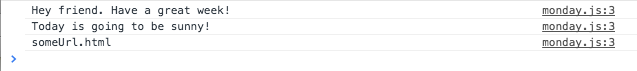

# MondayJS

#### An experimental Javascript MVC framework based entirely around the effective use of closures

It started with a question. Is it possible to do the following in `javascript`?

```javascript

    (function () {
        $asController("HelloWorld", this);
        $inject("GreetingsService", "WeatherService");
        $options({template: "someUrl.html"});

        onLoad = function (greet, weather) {
            greet.sayHi();
            weather.weatherForecast();

            $log(template)
        };
    })();
```

The output printed in google Chrome browser console



The answer it turns out is YES!

This lead to the creation of **MondayJS**. With `MondayJS` the above would be written as follows:

```javascript

    /* file: app.js */
    (function () {
        $monday.controller("HelloWorld", this);

        $required("GreetingsService", "WeatherService");
        $options({template: "someUrl.html"});
        onLoad = function (greet, weather) {
            greet.sayHi();
            weather.weatherForecast();

            $log(template);
        };
    })();
```

Or if you chose to create the controller outside of a controller:

```javascript

    var controller = $monday.controller("HelloWorld");

    controller.context = $required("GreetingsService", "WeatherService");
    controller.context.$options({template: "someUrl.html"});
    controller.context.onLoad = function (greet, weather) {
        greet.sayHi();
        weather.weatherForecast();

        $log(template);
    };
```

#### Motivation

I like `AngularJS`, but I am sometimes frustrated by the amount of code that needs to
be written to get going on a new project. I also want to write production code that just easy to read and understand.
Finally, I should be able to add `test annotations` that generate my tests.

# Easy like MondayJS

`Monday`, has only two constructs, controllers and services. That's it.

`Services` provide data to the `controller`, and `Controller` interact with the `DOM`.
This simple system allows you to use whatever type of 'drop-in' modules for your `models`.

#### Using MondayJS

We write our `Service`s like this in `MondayJS`.

```javascript
     /* file: greet.service.js */
     (function () {
         var service = $monday.service("GreetingsService");
         service.sayHi = function () {
             $log("Hey friend. Have a great week!");
         };
     })();

     /* file: weather.service.js */
     (function () {
         var service = $monday.service("WeatherService");
         service.weatherForecast = function () {
             $log("Today is going to be sunny!");
         };
     })();
```

Similarly, the associated html file:

```html
     <!DOCTYPE html>
     <html>
     <head lang="en">
        <meta charset="UTF-8">
        <title>Monday Demo</title>
     </head>
     <body>
        See the Javascript Console!
        <script src="lib/monday.js"></script>
        <script src="app/js/greet.service.js"></script>
        <script src="app/js/weather.service.js"></script>
        <script src="app/js/app.js"></script>
     </body>
     </html>
```

#### External Framework Dependencies

MondayJS has no dependencies on any other frameworks! It's beautifully simple,
and still very much **an experimental work in progress**.

#### Work Ahead

- simple data-binding
- testing using meta-functions
- routing
- modules
- templates??? not sure yet.

# Feedback and Contribution

I'd love to hear your feedback: [Harold Campbell](http://twitter.com/haroldcampbell)

# Versions

v0.1.0 - Changed API
v0.0.1 - Is it possible?